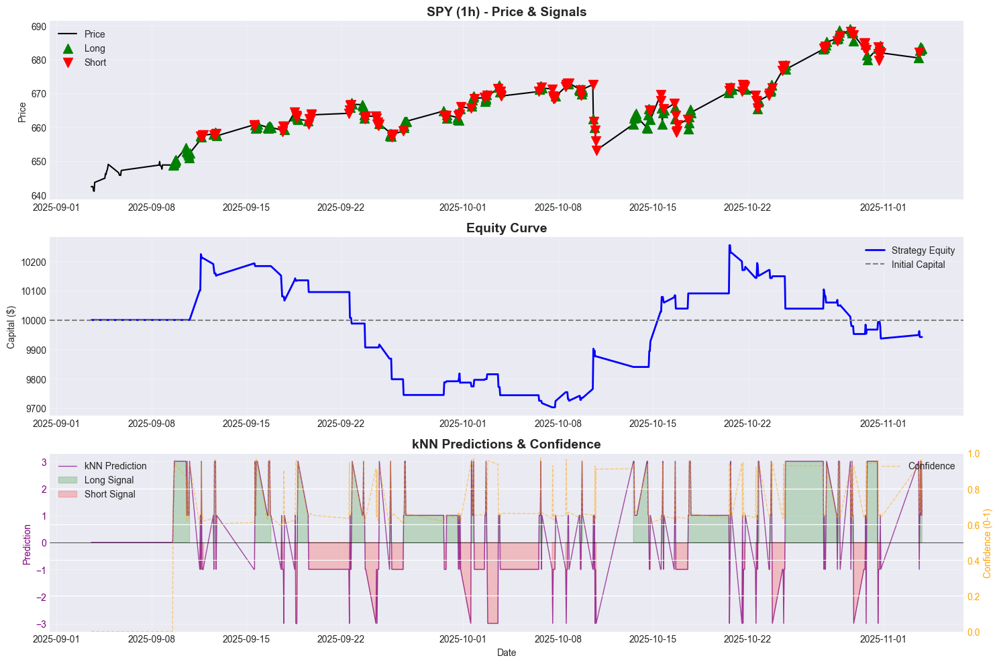

# kNN Trading Strategy - Multi-Asset Framework

A comprehensive backtesting framework using k-Nearest Neighbours machine learning for trading across multiple asset classes and timeframes.

## Features

- **Multi-Asset Support**: Stocks, Crypto, Commodities, Forex
- **Multi-Timeframe**: 5m, 15m, 1h, 4h, 1d, 1wk, 1mo
- **Technical Indicators**: RSI, CCI, ROC, Volume (normalized)
- **Confidence-Based Trading**: Only trades when model confidence exceeds threshold
- **Full Backtesting**: Complete backtesting engine with comprehensive metrics
- **Flexible Data Selection**: Choose by dates or number of bars
- **Comparison Tools**: Compare strategies across multiple assets and timeframes

## Installation

1. Clone the repository:

```bash
git clone <your-repo-url>
cd knn
```

2. Install required packages:

```bash
pip install -r requirements.txt
```

## Project Structure

```
knn/
├── knn_strategy.ipynb      # Main strategy notebook
├── requirements.txt        # Python dependencies
├── README.md              # This file
├── images/               # Screenshots and visualizations
│   ├── strategy_results.png
│   ├── equity_curve.png
│   ├── confidence_analysis.png
│   └── comparison_results.png
└── knn_strategy.pine      # TradingView Pine Script version (optional)
```

## Quick Start

```python
from knn_strategy import evaluate_knn_strategy, print_results, plot_results

# Evaluate strategy on Bitcoin hourly data
results = evaluate_knn_strategy('BTC-USD', interval='1h', num_rows=1000)
print_results(results)
plot_results(results)
```

## Usage Examples

### Basic Usage

```python
# Single asset evaluation with default settings
results = evaluate_knn_strategy('SPY', interval='1d', num_rows=500)
print_results(results)
```

### With Confidence Threshold

```python
# Only trade when confidence >= 0.6
results = evaluate_knn_strategy(
    symbol='BTC-USD',
    num_rows=500,
    interval='1d',
    k=15,
    confidence_threshold=0.6  # Only trade on confident predictions
)
print_results(results)
```

### Custom Parameters

```python
results = evaluate_knn_strategy(
    symbol='AAPL',
    start_date='2023-01-01',
    end_date='2024-12-31',
    interval='1d',
    indicator='RSI',  # Use only RSI indicators
    short_window=10,
    long_window=20,
    k=10,
    volatility_filter=True,
    bar_threshold=200,
    confidence_threshold=0.7
)
```

### Compare Multiple Assets

```python
from knn_strategy import compare_assets

assets = [
    {'symbol': 'SPY', 'num_rows': 500, 'interval': '1d'},
    {'symbol': 'BTC-USD', 'num_rows': 500, 'interval': '1d'},
    {'symbol': 'GC=F', 'num_rows': 500, 'interval': '1d'}
]

comparison = compare_assets(assets)
print(comparison)
```

### Example Output



_Multi-asset comparison results table_

## Parameters

### Data Selection

- `symbol`: Asset symbol (e.g., 'SPY', 'BTC-USD', 'GC=F')
- `start_date`: Start date (format: 'YYYY-MM-DD') or None for all available
- `end_date`: End date (format: 'YYYY-MM-DD') or None for all available
- `num_rows`: Number of most recent bars to use (ignores dates if specified)
- `interval`: Timeframe ('5m', '15m', '1h', '4h', '1d', '1wk', '1mo')

### Strategy Parameters

- `indicator`: Technical indicator to use ('RSI', 'CCI', 'ROC', 'Volume', or 'All')
- `short_window`: Short-term indicator period (default: 14)
- `long_window`: Long-term indicator period (default: 28)
- `k`: Number of nearest neighbors for kNN (default: 15)
- `confidence_threshold`: Minimum confidence (0-1) to generate signals (default: 0.5)
- `volatility_filter`: Only trade when ATR(10) > ATR(40) (default: False)
- `bar_threshold`: Maximum bars to hold a position (default: 300)

### Backtesting Parameters

- `initial_capital`: Starting capital (default: 10000)
- `commission`: Commission rate per trade (default: 0.001 = 0.1%)

## Asset Symbols

### Stocks

- SPY, QQQ, AAPL, MSFT, TSLA, etc.

### Crypto

- BTC-USD, ETH-USD, BNB-USD, etc.

### Commodities

- GC=F (Gold), CL=F (Oil), SI=F (Silver)

### Forex

- EURUSD=X, GBPUSD=X, USDJPY=X

## Strategy Details

### Algorithm

- Uses scikit-learn's NearestNeighbors for pattern recognition
- Features are normalized to [0, 1] range
- Uses Euclidean distance in multi-dimensional space
- Signals are generated by aggregating k nearest neighbor directions

### Confidence Calculation

The confidence score combines three factors:

- **Distance-based confidence**: Closer neighbors = higher confidence
- **Agreement-based confidence**: More unanimous neighbors = higher confidence
- **Signal strength**: Magnitude of prediction relative to k

### Trading Signals

- **Long**: When prediction > 0 and confidence >= threshold
- **Short**: When prediction < 0 and confidence >= threshold
- **No Trade**: When confidence < threshold

## Output Metrics

- Total Return (%)
- Buy & Hold Return (%)
- Excess Return (%)
- Total Trades
- Win Rate (%)
- Average Win (%)
- Average Loss (%)
- Profit Factor
- Sharpe Ratio
- Confidence Statistics
